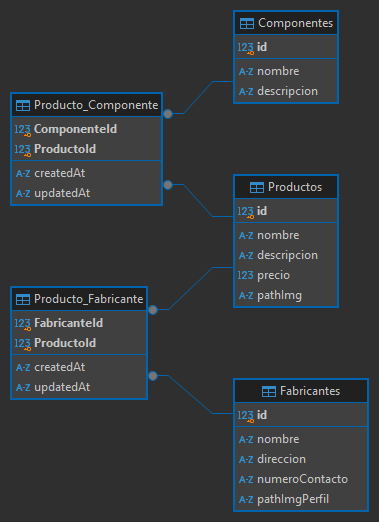

# Grupopersistencia - TP GRUPAL 1

Este proyecto implementa API REST desarollada con Express.js y SQLite. Permite gestionar operaciones CRUD sobre los recursos Producto, Fabricante y Componente, utilizando el ORM (Object-relational mapping) Sequelize.
Estas funcionalidades desarrolladas en el proyecyo permiten automatizar y gestionar de manera integrada los datos mediante un sistema web.

## Tecnologías utilizadas

- Node.js
- Express.js
- SQLite
- Nodemon

## Instalación

Ejecuta los siguientes comandos para correr la API en la máquina local.

### Requisitos previos

- Node.js
- npm (Node Package Manager)

### Pasos para la instalación y ejecución

- Clonar el repositorio

  `git clone https://github.com/EP-2024C2/tp-ntom-grupopersistencia.git`

- Instalar dependecias dentro del directorio del proyecto

  `npm i`

- Configurar la variable de entorno

- Inicializar el servidor

  `npm start`

- Para entornos de desarrollo (como nodemon) usar

  `npm run dev`

## Modelo Relacional

El proyecto presenta el siguiente diagrama de entidad-relacion (DER).

